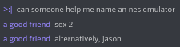

# jason

WIP NES emulator and general-purpose 6502 emulator.

## name?

## could i potentially use this in my own project?

j65, probably; it's pretty simple to interface with. jason, probably not unless you're making something NES related.

## how build? very exciting to see the colors and numbers in all of place this year the soap mario and other all vincent game

no

## how compile? see funny number with letters in it over and over until go completely insane

use `cpu/chk.sh` to compile j65. there are some tests in `tests/` but they do not cover the majority of opcodes yet.

## license?

The entire emulator is public domain under the Unlicense.
